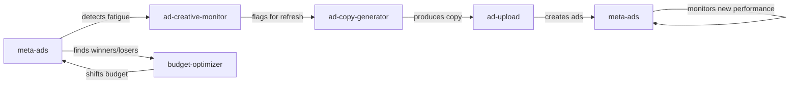

Meta Ads Kit is built on **5 specialized skills** that chain together into a complete ad management system. Each skill can run standalone or as part of the automated workflow.

<CardGroup cols={2}>
  <Card title="meta-ads" icon="bullseye" color="#ea5545">
    Core reporting — daily checks, bleeders, winners, fatigue detection
  </Card>
  
  <Card title="ad-creative-monitor" icon="chart-line" color="#f46a9b">
    Track creative performance over time, detect fatigue before it kills ROAS
  </Card>
  
  <Card title="budget-optimizer" icon="dollar-sign" color="#ef9b20">
    Analyze spend efficiency, recommend budget shifts between campaigns
  </Card>
  
  <Card title="ad-copy-generator" icon="pen-fancy" color="#edbf33">
    Generate ad copy matched to specific image creatives, outputs asset_feed_spec variants
  </Card>
  
  <Card title="ad-upload" icon="cloud-arrow-up" color="#ede15b">
    Push images and copy straight to Meta via Graph API — no Ads Manager required
  </Card>
</CardGroup>

---

## meta-ads

**The foundation.** This skill wraps [social-cli](https://github.com/vishalgojha/social-CLI) to give you the [5 Daily Questions](/concepts/daily-questions) that replace Ads Manager.

### What It Does

- **Daily briefings** — Spend pacing, active campaigns, 7-day trends
- **Bleeders report** 🩸 — Ads with high spend + low CTR bleeding your budget  
- **Winners report** 🏆 — Top performers ready to scale
- **Fatigue detection** 😴 — CTR declining, frequency climbing, CPC rising
- **Custom reports** — Ad performance broken down by age, gender, placement, etc.
- **Actions** (with approval) — Pause, resume, adjust budgets

### When You Use It

```bash
openclaw start
# Then:
"Daily ads check"
"Any ads bleeding money?"
"Which ads should I scale?"
"Check for creative fatigue"
"Show me performance by age and gender"
"Pause ad 12345678"
```

The agent handles orchestration, interprets the data, and asks before taking any action.

### Key Reports

| Report | What It Shows | When To Run |
|--------|---------------|-------------|
| **Daily Check** | All 5 questions in one go | Every morning |
| **Bleeders** | CTR < 1% or frequency > 3.5 + high spend | When budget feels wasted |
| **Winners** | Top CTR, low CPC, scaling headroom | When you have budget to shift |
| **Fatigue Check** | Day-over-day CTR/CPC/frequency trends | Weekly or when CTR dips |
| **Custom** | Any field + breakdown combo | On-demand investigation |

<Note>
All reporting is **read-only**. The skill can pull any data without asking. Actions that affect spend (pause/resume/budget changes) **always require explicit approval**.
</Note>

### Date Presets

You can run any report for:
- `today` — Today only
- `yesterday` — Yesterday only  
- `last_7d` — Last 7 days (default)
- `last_30d` — Last 30 days
- `last_90d` — Last 90 days

Example: `"Meta ads overview for last 30 days"`

### Files Read/Written

**Reads:**
- `ad-config.json` — Your benchmarks (target CPA, max frequency, etc.)
- `workspace/brand/stack.md` — Stored ad account ID (optional)
- `workspace/brand/learnings.md` — Past performance patterns (optional)

**Writes:**
- `workspace/brand/learnings.md` — Appends findings: fatigue patterns, winning creative traits, performance anomalies
- `workspace/brand/stack.md` — Stores ad account ID on first use

---

## ad-creative-monitor

**The early warning system.** Creative fatigue is the silent killer of ad accounts. This skill watches for fatigue signals daily and flags creatives that need rotation.

### What It Does

- **Daily CTR tracking** — Monitors CTR decay day-over-day at the ad level
- **Frequency creep detection** — Alerts when frequency exceeds thresholds
- **CPC inflation tracking** — Flags ads where CPC is quietly rising
- **Creative lifespan estimation** — Predicts when an ad will exhaust its audience
- **Rotation recommendations** — Tells you which ads to pause and when new creatives are needed

### Fatigue Signals (Ranked by Severity)

| Signal | Threshold | Severity |
|--------|-----------|----------|
| CTR dropping 3+ days in a row | >20% decline from peak | 🔴 Critical |
| Frequency above 3.5 | Audience seeing ad too often | 🟡 Warning |
| CPC rising 3+ days in a row | >15% increase from baseline | 🟡 Warning |
| Impressions declining | Ad losing delivery | 🟠 Monitor |

### When You Use It

```bash
"Check for creative fatigue"
"Are any ads getting stale?"
"Rank my creatives"
"What needs to be rotated?"
```

Typically runs:
- As part of the daily check (Question 5)
- Weekly on Mondays to plan creative refresh
- On-demand when you notice CTR dipping

### Example Output

```
😴 Fatigue Detected (2 ads):

Ad #23847111 "Notes App Hero"
CTR trend (7d): 3.2% → 3.0% → 2.8% → 2.5% → 2.2% 🔴
→ 31% decline from peak
Frequency: 2.1 → 2.8 → 3.4 → 3.9 🟡  
Recommendation: Rotate creative this week

Ad #23847115 "Receipt Close-up"
CPC trend: $1.10 → $1.25 → $1.55 → $1.82 🟡
→ 65% inflation over 4 days  
Recommendation: Pause or refresh copy
```

<Info>
**How it works:** Pulls ad-level insights with daily time increment (`--time-increment 1`), calculates day-over-day trends for CTR/CPC/frequency, compares against benchmarks in `ad-config.json`, flags any ad showing fatigue, and recommends rotation schedule.
</Info>

---

## budget-optimizer

**The efficiency analyzer.** Most ad accounts have budget spread evenly across campaigns when performance isn't even close to even. This skill finds where your money works hardest and recommends shifts.

### What It Does

- **Efficiency ranking** — Sorts campaigns/adsets by CPA, ROAS, or CPC
- **Budget shift recommendations** — Calculates how much to move from losers to winners
- **Spend pacing checks** — Flags over/underspend vs. daily or lifetime budgets
- **ROI comparison** — Shows which campaigns deliver the best return

### When You Use It

```bash
"Where's my money working best?"
"How should I shift my budget?"
"Am I overspending or underspending?"
"Analyze spend efficiency"
```

Typically runs:
- Weekly to optimize budget allocation
- When a campaign is underperforming  
- Before scaling winners

### How It Works

1. Pulls campaign and adset level insights for the specified period
2. Calculates efficiency metrics (CPA, ROAS, CPC relative to spend)
3. Compares against benchmarks in `ad-config.json`
4. Identifies top and bottom performers
5. Calculates recommended budget shifts (percentage-based)
6. Presents recommendations with clear reasoning
7. **Never adjusts budget without explicit approval**
8. Logs decisions to `workspace/brand/learnings.md`

### Example Output

```
Efficiency Analysis (Last 7 Days):

🏆 Best Performers:
1. Retargeting - Conversions
   Spend: $1,400 | CPA: $18.50 (target: $25)
   → Recommend +30% budget ($1,820/week)

2. Summer Launch - Traffic  
   Spend: $1,050 | CPC: $1.22 | CTR: 1.8%
   → Solid, maintain current budget

🩸 Underperformers:
1. Q1 Test Campaign
   Spend: $350 | CPA: $42.00 (target: $25) 
   → Recommend -50% budget ($175/week) or pause

Recommended Shifts:
- Move $175/week from Q1 Test → Retargeting
- Result: Estimated 8 more conversions/week at target CPA
```

<Note>
**Safety:** Budget changes are high-risk actions. This skill always shows current vs. recommended budget, explains the reasoning with data, waits for explicit "yes" before executing, and logs every change for audit trail.
</Note>

---

## ad-copy-generator

**The creative writer.** Generates Meta ad copy that's matched to specific image creatives — not generic copy pasted across every ad. Each image gets copy that reinforces its specific message.

### What It Does

- **Image analysis** — Uses vision to identify visual format (notes app, receipt, tweet, chart, etc.), on-image text, angle/hook, mood
- **Account data cross-reference** — Pulls your top-performing ads to find winning copy patterns
- **Psychology-driven variants** — Generates 3-5 headline + body variants, each hitting a different psychological trigger (Money, Time, Status, Fear)
- **Brand voice matching** — Reads `workspace/brand/voice-profile.md` to match tone and avoid forbidden words
- **asset_feed_spec output** — Formats copy ready for Meta's Degrees of Freedom optimization

### The Process (Simplified)

1. **Pull what's already working** — Check top 20 ads by CTR in last 30 days, extract copy patterns
2. **Load brand context** — Read voice profile, audience, positioning (or ask inline if not available)
3. **Analyze each image** — Identify format, on-image text, psychology, mood, funnel stage
4. **Write copy using psychology** — Rotate across the Four Horsemen (Money, Time, Status, Fear)
5. **Apply Meta specs** — Headlines 25-40 chars, body 50-120 words, 2-3 short paragraphs
6. **Generate variants** — 3-5 headlines × 3-5 bodies, each hitting different angles
7. **Cross-reference winners** — Match headline length, hook structure, proof claims to what's working
8. **Output asset_feed_spec** — JSON ready to feed into `ad-upload`

### When You Use It

```bash
"Write copy for this image" (attach ad creative)
"Generate ad copy for the summer sale campaign"
"Refresh copy for ad #12345678"
```

Typically runs:
- When `ad-creative-monitor` detects fatigue → time for fresh copy
- When launching new campaigns
- When testing new creative concepts

### Copy Specs (Meta Best Practices)

| Element | Spec | Why |
|---------|------|-----|
| Headline length | 25-40 chars, never >50 | Truncation on mobile kills CTR |
| Body word count | 50-120 words | Short enough to read, long enough to convince |
| Paragraphs | 2-3, each 1-2 sentences | Mobile readability — walls of text = scroll past |
| Numbers required | ≥1 per variant ($, %, or count) | Specificity = credibility |
| Social proof | Include where natural | "X+ customers" is highest-converting pattern |
| Opening line | Pain, stat, or bold claim | Never brand name, never "Introducing" |

### Example Output

```markdown
## Notes App Creative — "$17K/month"
*Image: iPhone notes app screenshot showing revenue number*
*Format: Notes app / organic*
*Psychology: Money + Status*
*Funnel: MoFu (Consideration)*
*Matched to image: Copy tells the story behind the number shown*

### Headlines
1. "We hit $17K/mo in 90 days" (29 chars) — Money
2. "This wasn't supposed to work" (30 chars) — Status  
3. "3 months. $17K. Here's how." (28 chars) — Money

### Body Copy

**V1 — Money: Specific Revenue Growth**
Most hosts think $5K/month is the ceiling.

We were stuck there for 8 months. Then we installed [product] and revenue jumped to $17K in 90 days.

No new listings. Same market. Just smarter pricing and automated guest communication.

2,400+ hosts already made the switch.
*68 words*

**V2 — Status: Peer Comparison** 
The top 10% of hosts in your market are already using this.

They're getting higher nightly rates, better reviews, and more direct bookings while you're stuck refreshing the Airbnb app.

$17K/month isn't luck. It's leverage.
*42 words*

### asset_feed_spec (ready for upload)
```json
{
  "bodies": [
    {"text": "Most hosts think $5K/month is the ceiling.\n\nWe were stuck there for 8 months. Then we installed [product] and revenue jumped to $17K in 90 days.\n\nNo new listings. Same market. Just smarter pricing and automated guest communication.\n\n2,400+ hosts already made the switch."},
    {"text": "The top 10% of hosts in your market are already using this.\n\nThey're getting higher nightly rates, better reviews, and more direct bookings while you're stuck refreshing the Airbnb app.\n\n$17K/month isn't luck. It's leverage."}
  ],
  "titles": [
    {"text": "We hit $17K/mo in 90 days"},
    {"text": "This wasn't supposed to work"},
    {"text": "3 months. $17K. Here's how."}
  ]
}
```
```

<Info>
**The critical rule:** Copy reinforces the image, never repeats it. If the image shows "$17K/month", the body tells the story behind that number. Image and copy are two halves of one message.
</Info>

### Files Written

```
workspace/campaigns/[campaign-name]/ads/
  [creative-name].md          - Full copy document  
  [creative-name].json        - asset_feed_spec JSON (ready for ad-upload)
```

Appends to `workspace/brand/assets.md`:
```
| [creative-name] copy | ad-copy | 2026-03-04 | [campaign] | draft | 3 headlines, 3 bodies |
```

---

## ad-upload

**The publisher.** Takes copy and images from `ad-copy-generator` and pushes them straight to Meta via Graph API. No Ads Manager. No manual creative setup. Just: generate, review, upload.

### What It Does

- **Image upload** — Pushes images to Meta ad account, returns image hashes
- **Creative building** — Constructs asset_feed_spec creatives with multiple copy variants
- **Ad creation** — Creates ads in existing ad sets (always as PAUSED for review)
- **Copy refresh** — Swaps fresh copy into existing ads to preserve metric history
- **Batch mode** — Uploads multiple ads in one session

### The Upload Chain

```
1. Validate copy + image
       |
2. Upload image → get hash  
       |
3. Create creative with asset_feed_spec
       |
4. Create ad (or update existing)
       |
5. Save IDs to campaign files
```

### When You Use It

```bash
"Upload the summer-sale ads to Meta"
"Push this creative to ad set 238470000001"
"Refresh copy on ad ID 238471111111"
"Batch upload all ads in the Q2 campaign"
"Dry run: what would happen if I uploaded these ads?"
```

Typically runs:
- Right after `ad-copy-generator` produces asset_feed_spec JSON
- When refreshing fatigued creatives
- When launching new campaigns

### Validation (Before Upload)

Runs local checks before touching the API:

| Check | Rule |
|-------|------|
| Headline | Max 40 chars (hard stop at 50) |
| Body | 50-500 chars per variant |
| Description | Max 30 chars |
| Image format | JPG or PNG only |
| Image size | Under 30MB, min 600×600px |
| Aspect ratio | 1:1, 4:5, 16:9, or 9:16 |

If validation fails, you see the errors before any API calls.

### Dry-Run Mode

Add `--dry-run` to see exactly what would be sent **without hitting the API**:

```
"Upload these ads -- dry run first"
```

Shows:
- Validation results
- Exact JSON payload for each endpoint  
- Estimated creative/ad names
- No API calls made, no IDs returned

### Example Output

```
[1/3] notes-app
  ✓ Copy validated (3 headlines, 3 bodies)
  ✓ Image uploaded → hash: a1b2c3d4e5f6789abc
  ✓ Creative created → ID: 23847293847293847
  ✓ Ad created → ID: 23847111111111111 (PAUSED)

[2/3] receipt  
  ✓ Copy validated (3 headlines, 2 bodies)
  ✓ Image uploaded → hash: d4e5f6a7b8c9d0e1f2
  ✓ Creative created → ID: 23847293847293848
  ✓ Ad created → ID: 23847111111111112 (PAUSED)

Batch complete: 2 ads created, all PAUSED
Review at: https://www.facebook.com/adsmanager/manage/ads
```

<Note>
**Always creates ads as PAUSED.** Review in Ads Manager before activating. This prevents accidental budget burn.
</Note>

### Files Written

```
workspace/campaigns/{campaign-name}/ads/
  {creative-name}.upload.json  <- API response (creative ID, ad ID, status)
```

Example `upload.json`:
```json
{
  "uploaded_at": "2026-03-04T08:00:00Z",
  "campaign": "summer-sale-2026",
  "ad_name": "notes-app",
  "image_hash": "a1b2c3d4e5f6789abc",
  "creative_id": "23847293847293847",
  "ad_id": "23847111111111111",
  "adset_id": "23847000000001",
  "status": "PAUSED",
  "review_url": "https://www.facebook.com/adsmanager/manage/ads?act=123456789"
}
```

Appends to `workspace/brand/assets.md`:
```
| summer-sale-2026 notes-app | ad | 2026-03-04 | creative: 238472... ad: 238471... | PAUSED |
```

---

## How Skills Work Together

The five skills chain into a closed loop:



**Example workflow:**

1. **meta-ads** runs daily check → finds Ad #238471 has frequency 4.2, CTR dropped 40%
2. **ad-creative-monitor** confirms fatigue signal → recommends rotation
3. **ad-copy-generator** writes 3 new body variants + 3 headlines matched to the same image
4. **ad-upload** pushes fresh creative, attaches to existing ad (preserves ad ID and history)
5. **meta-ads** monitors new creative performance over next 7 days
6. If new copy outperforms, **budget-optimizer** recommends scaling it

No Ads Manager required at any step.

---

## Next Steps

<CardGroup cols={2}>
  <Card title="Daily Questions" icon="clipboard-question" href="/concepts/daily-questions">
    Understand the 5 questions that power the daily check
  </Card>
  
  <Card title="Workflow" icon="rotate" href="/concepts/workflow">
    See how skills chain into the full automation loop
  </Card>
  
  <Card title="Setup Guide" icon="rocket" href="/quickstart">
    Get your ad account connected and run your first report
  </Card>
  
  <Card title="Configuration" icon="sliders" href="/configuration">
    Customize benchmarks and skill behavior
  </Card>
</CardGroup>